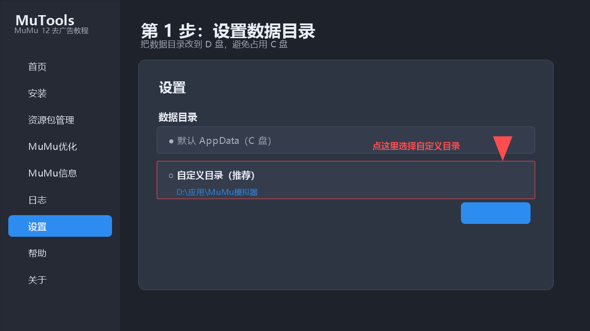
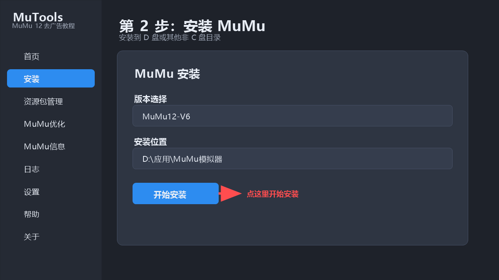
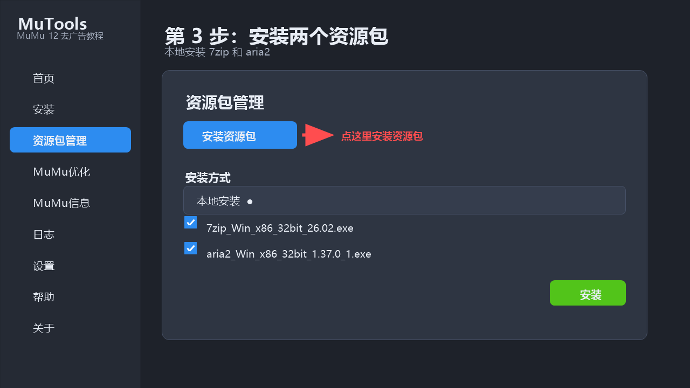
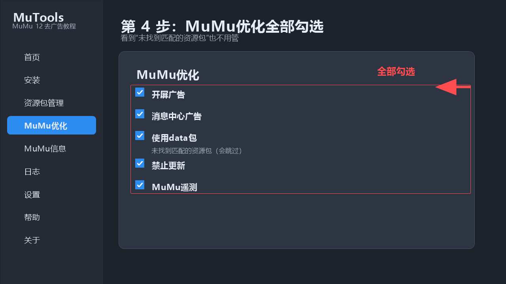
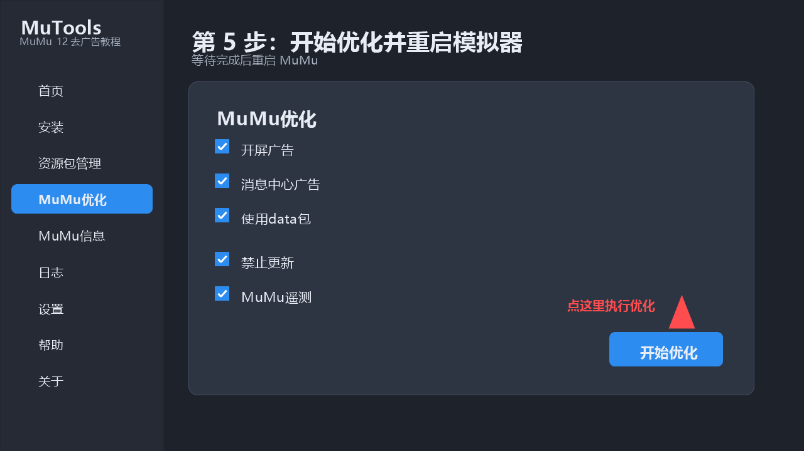

# MuMu模拟器12去广告工具（MuTools 教程版）

本项目是基于 **MuToolsProject** 整理的 GPL-3.0 发布版。按下面的视频流程操作，安装并使用两个资源包即可完成 MuMu 模拟器去广告。

> 本项目不是 MuMu 官方项目，与 MuMu 官方没有任何隶属或合作关系。

## 需要下载什么

| 文件 | 下载位置 | 用途 |
| --- | --- | --- |
| `MuTools.exe` | [Release 便携版](https://github.com/Kyuubi-Nyan/MuMu12-Ad-Removal/releases/download/v1.1.0/MuTools.exe) | MuTools 主程序 |
| `7zip_Win_x86_32bit_26.02.exe` | [直接下载 7zip](https://github.com/Kyuubi-Nyan/MuMu12-Ad-Removal/releases/download/resources-v1.0.0/7zip_Win_x86_32bit_26.02.exe) | 解压 7z 资源 |
| `aria2_Win_x86_32bit_1.37.0_1.exe` | [直接下载 aria2](https://github.com/Kyuubi-Nyan/MuMu12-Ad-Removal/releases/download/resources-v1.0.0/aria2_Win_x86_32bit_1.37.0_1.exe) | 下载加速 |
> GitHub 左侧或右侧的 Releases 区域只显示发布名称，不会直接显示下载按钮。点击 Release 标题进入发布页，再在 Assets 中点击文件下载；也可以直接点击上表的下载链接。
## 使用教程

### 第 1 步：设置数据目录路径

1. 打开 MuTools。
2. 点击左侧的 **设置**。
3. 把数据目录改成 **自定义路径**。
4. 选择一个不在 C 盘的目录，例如：

```text
D:\应用\MuMu模拟器
```

5. 保存设置，建议重启一次 MuTools。



### 第 2 步：安装 MuMu

1. 点击左侧的 **安装**。
2. 选择需要安装的 MuMu 版本，例如 `MuMu12-V6`。
3. 把安装目录设置到 D 盘或其他非 C 盘目录。
4. 选择 **在线安装**；如果在线源不稳定，就先准备安装包，再选择 **本地安装**。
5. 等待安装完成。



### 第 3 步：安装两个资源包

1. 下载 `资源包` 文件夹里的两个 exe。
2. 在 MuTools 左侧点击 **资源包管理**。
3. 点击 **安装资源包**。
4. 安装方式选择 **本地安装**。
5. 先选择：

```text
7zip_Win_x86_32bit_26.02.exe
```

6. 再安装：

```text
aria2_Win_x86_32bit_1.37.0_1.exe
```

7. 安装完成后，资源包列表里应该能看到 `7zip` 和 `aria2`。



### 第 4 步：进入 MuMu 优化并全部勾选

1. 点击左侧的 **MuMu优化**。
2. 把页面上的优化项目全部勾选。
3. 如果“使用data包”下面显示：

```text
未找到匹配的资源包
```

不用管，它会跳过这一项，其他勾选项目仍然会执行。

4. 页面上的说明会告诉你每个项目的副作用，确认后再继续。



### 第 5 步：开始优化并重启模拟器

1. 点击页面底部的 **开始优化**。
2. 等待工具提示优化完成。
3. 完全退出 MuMu，然后重新启动。
4. 检查开屏广告、消息中心和桌面广告是否消失。
5. 如果需要恢复，回到 **MuMu优化** 页面点击 **撤销优化**，再重启 MuMu。



## 资源包目录

本仓库把两个资源包单独放在：

[进入 `资源包` 目录](资源包/README.md)

资源包说明、来源和校验值都在该目录的 README 中。

## 从源码构建

构建环境：

- Windows 10/11 64 位
- Node.js 20 或更高版本
- Rust stable（MSVC 工具链）
- Visual Studio Build Tools，并安装“使用 C++ 的桌面开发”
- Microsoft Edge WebView2 Runtime

构建命令：

```powershell
cd MuToolsCode
npm install
npm run tauri build
```

构建完成后的程序位于：

```text
MuToolsCode/src-tauri/target/release/mutools.exe
```

## 常见问题

### 1. 为什么“使用data包”显示未找到资源包？

因为本教程只使用 `7zip` 和 `aria2`，不使用 `DataPart`。这一项会跳过，不影响其他优化项目。

### 2. 工具检测不到 MuMu

先确认 MuMu12 已经安装并至少启动过一次。如果仍然检测不到，尝试以管理员身份运行 MuTools。

### 3. 为什么需要管理员权限？

去广告、修改 hosts、禁用更新、处理部分模拟器文件等操作需要系统权限，确认工具来源可信后再允许。

### 4. 杀毒软件报警怎么办？

MuTools 会修改 hosts、更新程序或部分模拟器文件，可能被安全软件标记。先核对文件来源，不要直接关闭安全软件。

### 5. 可以恢复吗？

可以。回到 **MuMu优化** 页面，点击 **撤销优化**，完成后重启 MuMu。

## 项目目录

```text
MuMu12-Ad-Removal/
├── 资源包/                      # 7zip、aria2 和教程图片
│   ├── 7zip_Win_x86_32bit_26.02.exe
│   ├── aria2_Win_x86_32bit_1.37.0_1.exe
│   ├── SHA256SUMS.txt
│   └── 教程/
├── MuToolsCode/                 # 主程序：前端 + Tauri + Rust 后端
├── Tools_desc_generator/        # 资源包描述生成器
├── Tools_portable_builder/      # 便携版构建工具
├── LICENSE                      # GPL-3.0 许可证
├── UPSTREAM_README.md           # 原项目 README 备份
└── build.bat                    # 构建脚本
```

## 来源、修改记录和开源协议

- 原项目：[godeargit/MuToolsProject](https://github.com/godeargit/MuToolsProject)
- 本仓库是独立的 GPL-3.0 发布整理版，代码来源于原项目。
- 本次发布修改：重新整理教程、增加 `资源包` 目录和步骤图片、补充发布说明。
- 本仓库保留原项目的 `LICENSE`，继续使用 **GNU GPL v3.0**。
- 发布编译版时，对应源码可在本仓库获取，符合 GPL-3.0 的源码提供要求。
- 项目中涉及的 7-Zip、aria2 等第三方组件遵循各自的官方许可证。